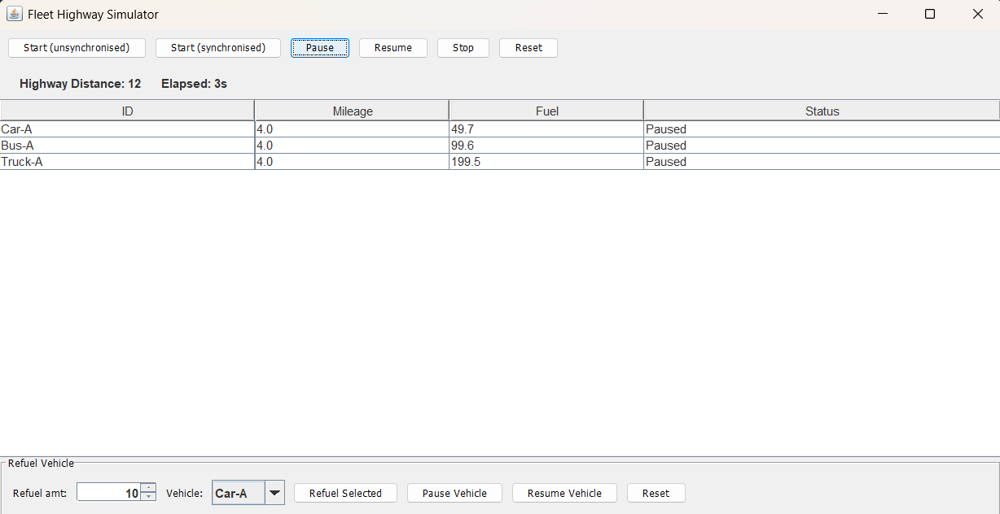
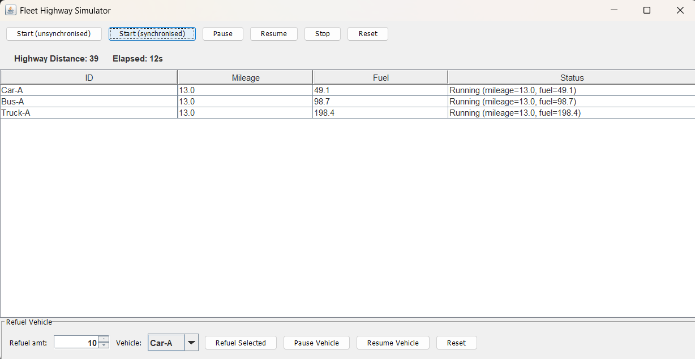

<h1>Fleetmanagement + Multithreaded Highway Simulator</h1>

- **Purpose**: Each vehicle runs on its own thread, updates a shared highway distance counter, and can be controlled via a CLI or a Swing GUI. The simulator includes a deliberate unsynchronized counter to demonstrate lost updates and a synchronized mode to fix the race.

**Tech Stack**
- **Language**: Java 24
- **Build**: Maven (`pom.xml`)
- **UI**: Swing (`SimulationGUI`)

**Quick Start**
- Build the project:
```cmd
mvn clean install
```
- Run the GUI:
```cmd
mvn exec:java -Dexec.mainClass="fleet.SimulationGUI"
```
- Run the CLI entry point (if desired):
```cmd
mvn exec:java -Dexec.mainClass="Main"
```

**Main Files & Classes**
- **`src/main/java/fleet/Simulation.java`**: Core simulation manager. Creates vehicle tasks, starts per-vehicle threads, exposes APIs to start/pause/resume/stop/reset the simulation, and supports per-vehicle pause/resume and refuelling.
- **`src/main/java/fleet/SimulationGUI.java`**: Swing UI with a `JTable` showing vehicles, controls to start (unsynchronised/synchronised), pause/resume/stop, refuel, per-vehicle pause/resume, and reset.
- **`src/main/java/Main.java`**: CLI entry (menu-driven) — provides alternate control for starting, stopping and inspecting the simulation.
- **`src/main/java/vehicles/`**: Vehicle implementations (`Car`, `Bus`, `Truck`, `Vehicle` base class).

**Features**
- **Per-vehicle threads**: Each vehicle runs independently and updates mileage and fuel.
- **Shared highway counter**: `Simulation.highwayDistance` — can be run unsynchronised (race condition) or synchronised (fixed).
- **Pause/Resume**: Global pause/resume for the whole simulation.
- **Per-vehicle Pause/Resume**: Pause or resume individual vehicles from the GUI (drop-down + buttons).
- **Refuel**: Refuelling updates fuel only and does not change pause/run state. (If a vehicle is paused it remains paused after refuel.)
- **Reset**: Resets highway distance and elapsed time to zero and re-initialises vehicles (refuel + Ready state).

**Thread-safety note**
- The GUI uses `Simulation.getVehicleTableSnapshot()` to build a read-only copy of vehicle data for display. Because the method returns a newly constructed list/array snapshot and the GUI only reads from it on the Event Dispatch Thread, additional synchronization is not required for correctness in this monitoring UI. Values may still change immediately after the snapshot is taken, but it does maintain thread safety nevertheless.

Considering it's a read-only operation, there isn't anything that would lead to a race condition other than the highway counter, for which the simulation already provides both unsynchronised (demo) and synchronised options.

**Thread-safe collections used**
- To make concurrent iteration and lifecycle updates robust, `Simulation` uses thread-safe collections:
    - `tasks` and `threads` are `CopyOnWriteArrayList` instances — safe to iterate from the GUI while the simulation adds/removes entries.
    - `vehicleStatus` is a `ConcurrentHashMap` — supports concurrent reads/writes without external synchronization.

These choices match the access pattern (many reads from the GUI, infrequent writes during start/stop/reset) and reduce the chance of concurrent-iteration issues. If you later need fully-consistent multi-field snapshots, consider short, explicit locking when building that snapshot.

<h2>GUI Explanation</h2>



<ol>
    <li>Start (unsynchronised) - Starts the unsynchronised version of the simulation for all threads</li>
    <li>Start (synchronised) - Starts the synchronised version of the simulation for all threads</li>
    <li>Pause - Pauses simulation for all threads</li>
    <li>Resume - Resumes simulation for all threads</li>
    <li>Stop - Ends simulation for all threads</li>
    <li>Reset - Sets all threads to their initialized state before the simulation</li>
    <li>Refuel - To fill fuel in a vehicle</li>
</ol>


<h2>Unsynced Threads (Race Condition)</h2>


<p>Here we can clearly see, when the threads arent synchronized, the critical section variable ""Highway distance" isnt correctly updating.
Each vehicles mileage is 8, and the total distance should be 24.

However, due to race condition, the value isnt updated properly by all threads, leading to mismatch</p>

<h2>Synced Threads</h2>

<p>After putting the critical section (updating of the highway distance) in a synchronised block, we can clearly see the highway distance is the correct sum of he individual mileages of the individual threads</p>



<p></p>
